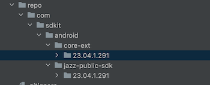

[Основную документацию можно найти тут](https://clck.ru/35aWZB)

[Что бы создать комнату, для начала получите ключ авторизации тут](https://clck.ru/35aWZw)

[Инициализация](READ-sdk-initialization.md)

[Сценарии использования](READ-sdk-scenarios.md)

[Лицензия на использование](https://clck.ru/35F8h3)

## Как подключить JAZZ SDK
### 1 Шаг. В settings.gradle, аналогично заполняем блок repositories, обязательно не забыть про jcenter():
```groovy
dependencyResolutionManagement {
   repositoriesMode.set(RepositoriesMode.FAIL_ON_PROJECT_REPOS)
   repositories {
      google()
      mavenCentral()
      jcenter()

      // Здесь указаны ссылки на внутренние прокси к mavenCentral и google-репозиториям,
      // и также указана ссылка на локальный репозиторий во внутреннем проекте.
      maven { url "$rootDir/repo" }
   }
}
```

Это путь где будем локально хранить артефакты SDK:
```groovy
 maven { url "$rootDir/repo" }
```

### 2 Шаг. Создаем необходимые директории для имитации мавена, структура должна получиться как на скрине ниже:


В build.gradle эта структура будет выглядеть так: implementation("com.sdkit.android:jazz-public-sdk:$version")

### 3 Шаг. Добавляем необходимые опции в build.gradle в модуле app перед sync project:

* Проверяем блок plugins, в нем должны быть необходимые плагины, как на скрине ниже:
```groovy
plugins {
    id 'com.android.application'
    id 'org.jetbrains.kotlin.android'
}
```
* Дополняем блок Android:
  * Указываем compileSdk, должен быть выше 30
  * Подключаем viewBinding и мержим ресурсы(Как на скрине ниже)
```groovy
    buildFeatures {
        viewBinding true
    }
    packagingOptions {
        pickFirst '**/*.so'
        pickFirst 'META-INF/kotlinx_coroutines_core.version'
    }
 ```
* Дополняем блок dependencies:
```groovy
    //Jazz SDK
    implementation("com.sdkit.android:core-ext:23.07.1.29")
    implementation("com.sdkit.android:jazz-public-sdk:23.07.1.29")
    implementation("com.sdkit.jazz:jazzcastlib:1.14.45")

    //region TODO Не правильно подтягиваются из pom зависимости, подключенные через bom
    implementation(platform('androidx.compose:compose-bom:2022.11.00'))
    implementation(platform('com.google.firebase:firebase-bom:32.0.0'))
    //endregion
 ```


#### Дополнительный материал:

[Инициализация](READ-sdk-initialization.md)

[Сценарии использования](READ-sdk-scenarios.md)